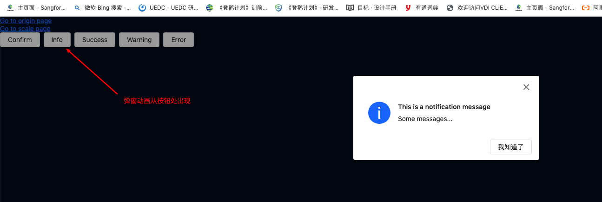
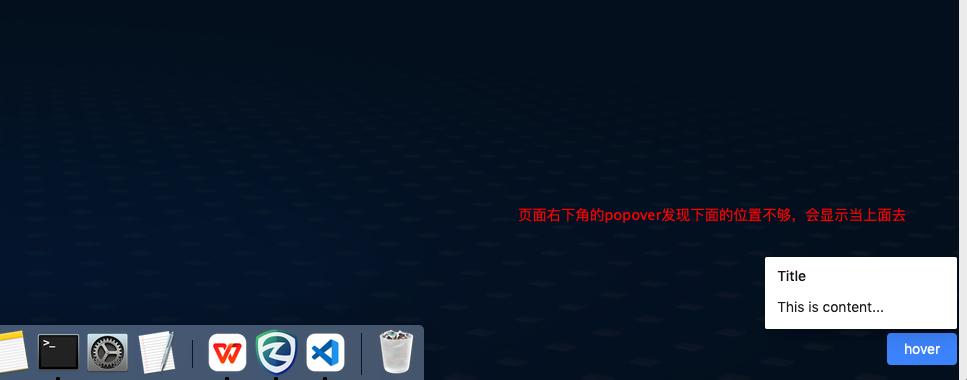
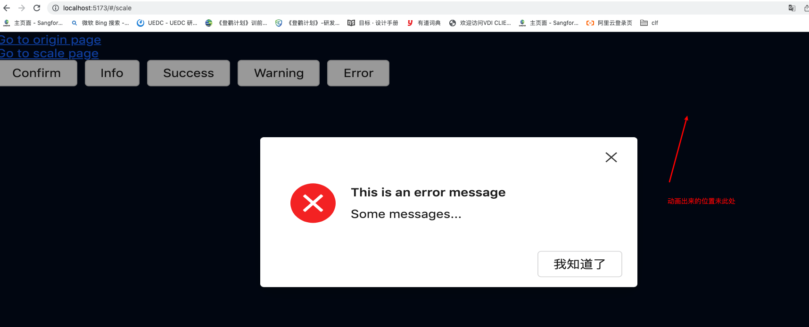
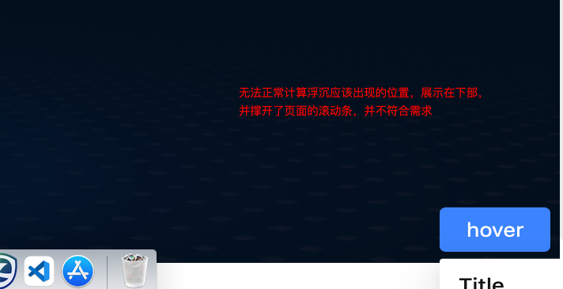

# idux-scale-bug-demo
复现idux 浮层组件以及弹窗组件在body被设置缩放产生的问题

## 项目启动
yarn install;
yarn dev;

## 页面说明
### 未对body进行缩放的场景下的表现情况
http://localhost:5173/#/origin

### 对body进行缩放后的表现情况
http://localhost:5173/#/scale

